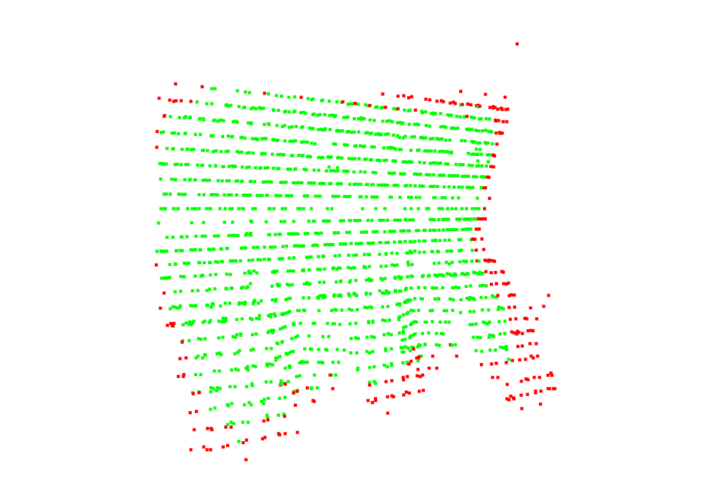
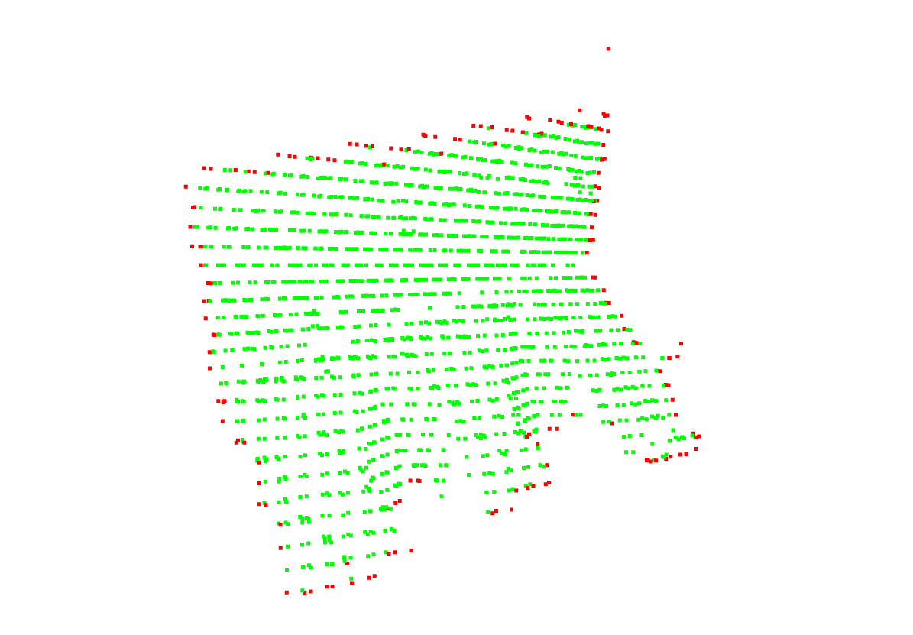
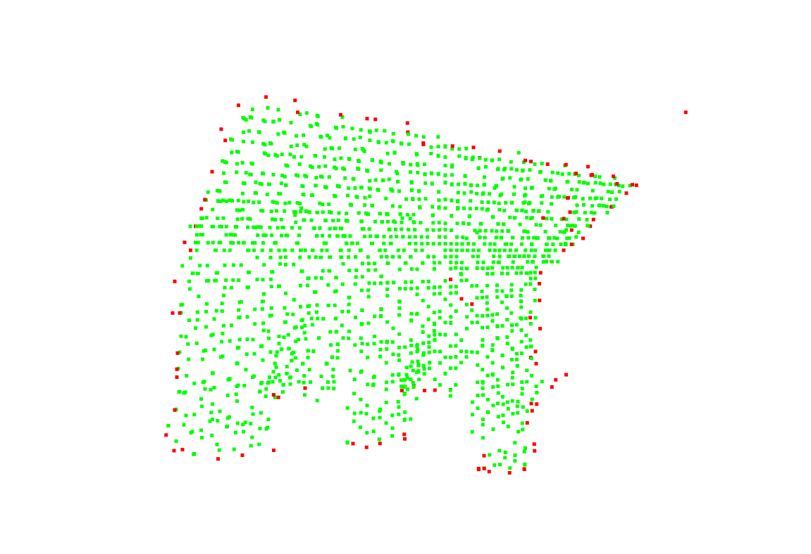

# BorderBlaze
An Automated Tool to Segment Boundary Points in Lidar Point Cloud Data

I applied three methods to segment boundary points in lidar point cloud data of building roofs
1. K Nearest Neighbor algorithm.
2. Concave Hull Algorithm
3. Delaunay Triangulation
Tools: FastAPI, Python, React


You can check project slides here: https://docs.google.com/presentation/d/1-yDwAAvjtULVYhcMNNtuOEA1ScHNVBjZUIxOswtsQZs/edit#slide=id.g27d6770334c_0_332


## Screenshots







## Installation

Install my-project with pip

```python
  pip install -r requirements.txt
```
    
## Deployment

To deploy the project frontend run:

```bash
  cd frontend
  npm start
```

For backend run:
```bash
  cd backend
  uvicorn main:app --reload
  uvicorn neighborhood:app --port 8001
  uvicorn concavelhull:app --port 8002
  uvicorn delaunaytriangulation:app --port 8003
```
## References

1. Tseng, Y. H., & Hung, H. C. (2016). Extraction of building boundary lines from airborne lidar point clouds. The International Archives of the Photogrammetry, Remote Sensing and Spatial Information Sciences, 41, 957-962.

2. Awrangjeb, M., & Lu, G. (2015, November). A triangulation-based technique for building boundary identification from point cloud data. In 2015 International Conference on Image and Vision Computing New Zealand (IVCNZ) (pp. 1-6). IEEE.

3. Dey, E. K., Awrangjeb, M., Kurdi, F. T., & Stantic, B. (2021, November). Building Boundary Extraction from LiDAR Point Cloud Data. In 2021 Digital Image Computing: Techniques and Applications (DICTA) (pp. 1-6). IEEE.


